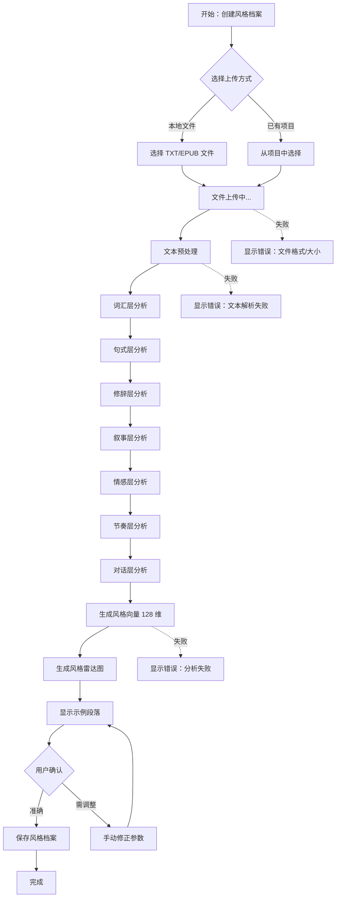
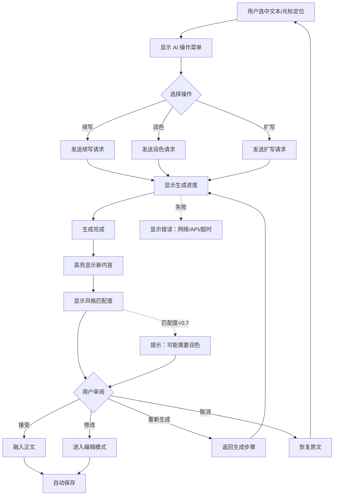
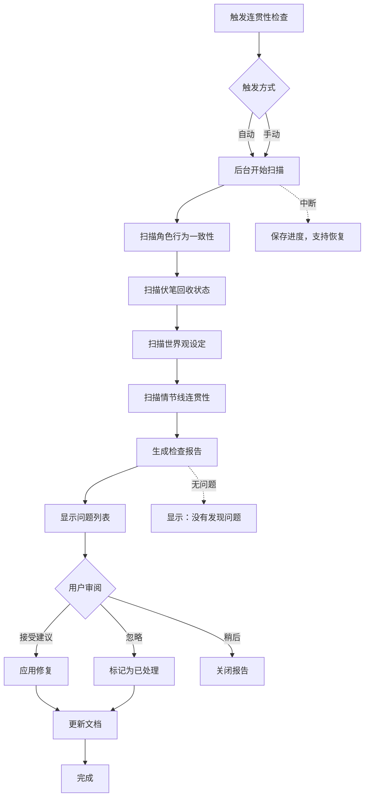
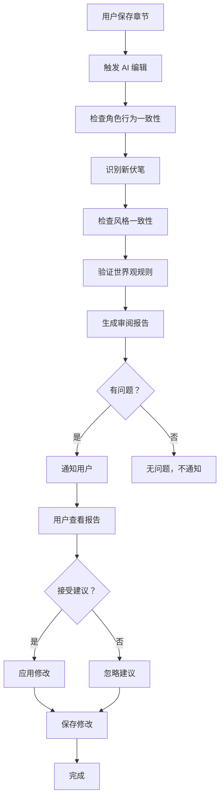

# UX Design Specification Novel Agent

**Author:** Hamsing
**Date:** 2026-04-09

---

<!-- UX design content will be appended sequentially through collaborative workflow steps -->

## Executive Summary

### Project Vision

Novel Agent 是一款面向专业网络小说作家的 AI 辅助创作工具，核心使命是**让 AI 解放作家，给作家更多灵感**。这不是替代作家的工具，而是增强创造力的工具——让作家从重复性劳动、长篇连贯性维护中解脱出来，专注于真正的创意和故事核心。

### Target Users

- **核心用户：** 专业网络小说作家（写作是收入来源）
- **使用场景：** 长篇小说创作（数十万至数百万字）
- **核心痛点：** AI 生成内容有 AI 味道、长篇连贯性差、风格不一致

### Key Design Challenges

1. **复杂性管理** - 系统功能丰富（风格分析、伏笔追踪、角色管理等），如何避免界面混乱？
2. **创作沉浸感** - 作家需要专注创作，如何平衡强大功能与简洁体验？
3. **AI 协作透明度** - 用户需要理解 AI 在做什么，同时保持控制感

### Design Opportunities

1. **差异化体验** - 现有 AI 写作工具功能简单，可打造专业级创作工作台
2. **视觉化叙事管理** - 将抽象的伏笔、角色关系、情节线可视化
3. **心流支持** - 为作家打造沉浸式创作环境，减少认知负荷

## Core User Experience

### Defining Experience

**核心用户行为：** 作家在编辑器中进行 AI 辅助创作

**最关键的交互：** 选中文本 → 唤起 AI 操作菜单 → 选择操作（续写/润色/扩写）→ 生成 → 审阅 → 接受/修改

这个流程必须**完全流畅**，不能打断创作心流。

### Platform Strategy

| 维度 | 决策 |
|------|------|
| **平台** | Web 应用（纯 Web，无需移动端） |
| **交互方式** | 鼠标/键盘为主（专业作家使用物理键盘写作） |
| **浏览器** | 现代浏览器（Chrome/Firefox/Safari/Edge 最新版 -2） |
| **离线功能** | 本地存储（SQLite + 文件系统），无需网络即可创作 |
| **AI 生成** | 需要网络（调用 LLM API） |

### Effortless Interactions

| 交互 | 设计方式 |
|------|---------|
| **开始写作** | 打开项目即进入编辑器，零点击 |
| **AI 续写** | 选中段落 → 右键/快捷键 → 选择操作 |
| **风格应用** | 项目创建时选择，全局自动应用 |
| **自动保存** | 完全后台，仅状态栏提示 |
| **版本回滚** | 点击历史版本 → 预览 → 确认恢复 |

### Critical Success Moments

| 时刻 | 设计目标 |
|------|---------|
| **第一次使用** | 上传小说 → 分析风格 → 看到风格报告 → "对，这就是我的风格" |
| **第一次 AI 生成** | 选中文本 → AI 续写 → 生成内容 → "这看起来像我写的" |
| **长篇创作中** | 系统提醒伏笔/一致性问题 → "原来这里有漏洞，幸好提醒了" |
| **完本后** | 回顾整部作品 → 风格一致、无明显 AI 痕迹 → "这工具真的帮到我了" |

### Experience Principles

| 原则 | 描述 |
|------|------|
| **编辑器优先** | 一切为编辑体验让路，功能面板可收起 |
| **AI 无形** | AI 功能深度集成，不单独成"模块" |
| **专业沉稳** | 视觉风格像 IDE，不像 AI 产品 |
| **心流保护** | 任何可能打断创作的操作用确认/撤销保护 |
| **本地优先** | 数据存储在本地，云是可选的增强 |

## Desired Emotional Response

### Primary Emotional Goals

| 情感 | 描述 | 为什么重要 |
|------|------|-----------|
| **掌控感** | "我是创作者，AI 是我的工具" | 避免 AI 替代作家的焦虑 |
| **专注沉浸** | "进入心流，忘记工具存在" | 专业作家需要深度创作状态 |
| **信任可靠** | "数据不会丢，AI 建议可参考" | 长篇小说是长期投入，需要信任 |
| **专业自信** | "这是个专业工具，我是专业作家" | 区别于"AI 写作玩具"的定位 |

### Emotional Journey Mapping

| 阶段 | 期望情感 | 设计支撑 |
|------|---------|---------|
| **初次使用** | 好奇 → 认可 | 风格分析报告精准，"这就是我的风格" |
| **第一次 AI 生成** | 怀疑 → 惊喜 | 生成内容风格匹配度高 |
| **日常创作** | 专注、流畅 | 编辑器沉浸，AI 无形 |
| **收到提醒** | 感谢而非被打扰 | 伏笔/一致性提醒有价值 |
| **完本回顾** | 成就感、感激 | 风格一致、无明显漏洞 |

### Micro-Emotions

| 情感对比 | 设计目标 |
|---------|---------|
| **信心 vs 困惑** | 任何操作有明确反馈，无"黑箱"感 |
| **信任 vs 怀疑** | AI 生成内容标注来源和风格匹配度 |
| **惊喜 vs 平淡** | 风格分析生成雷达图和示例段落 |
| **成就 vs 挫败** | 字数里程碑、章节完成动画 |

### Design Implications

| 情感目标 | UX 设计方式 |
|---------|------------|
| **掌控感** | AI 操作需要用户主动唤起，从不自动替换内容 |
| **专注** | 编辑器无边框，功能面板可收起，一键心流模式 |
| **信任** | 自动保存状态实时显示，历史版本可随时回滚 |
| **专业** | 深色 IDE 风格，无 AI 产品常见的高饱和度装饰 |

### Emotions to Avoid

| 负面情感 | 原因 | 防御设计 |
|---------|------|---------|
| **被替代感** | "AI 写得比我好"的焦虑 | AI 内容明确标注，始终需要用户确认 |
| **失控感** | "不知道 AI 在做什么" | 生成进度实时显示，可随时取消 |
| **被打断** | 创作心流被破坏 | 通知延迟到章节完成，紧急程度分级 |
| **被 judge** | "我的写作被评分" | 风格匹配度是私密反馈，不公开评分 |

### Emotional Design Principles

1. **工具而非作者** - 任何时候都明确 AI 是辅助，决策权在用户
2. **进步而非评判** - 反馈聚焦于"如何更好"，不是"你不够好"
3. **支持而非干扰** - 任何提醒都经过重要性过滤
4. **专业而非炫技** - 视觉沉稳，功能强大但不炫耀

## UX Pattern Analysis & Inspiration

### Inspiring Products Analysis

**1. 专业写作/创作工具**

| 产品 | 值得学习的 UX | 可借鉴的模式 |
|------|--------------|-------------|
| **Scrivener** | 强大的项目组织、卡片墙大纲 | 长文本管理、情节卡片 |
| **Ulysses** | 极简编辑体验、无干扰模式 | 专注写作、Markdown 集成 |
| **Notion** | 灵活的内容组织、块编辑 | 内容块管理、侧边栏导航 |

**2. IDE（专业开发工具）**

| 产品 | 值得学习的 UX | 可借鉴的模式 |
|------|--------------|-------------|
| **VS Code** | 深色主题、命令面板、侧边栏架构 | 专业感、快速操作、可扩展面板 |
| **JetBrains IDE** | 智能代码检查、重构建议 | 类似我们的"一致性检查"提示方式 |
| **Cursor** | AI 深度集成于编辑器 | AI 操作菜单、行内生成 |

**3. AI 工具（参考 + 反向参考）**

| 产品 | 值得学习的 | 要避免的 |
|------|-----------|---------|
| **Cursor** | AI 操作在编辑器内完成 | 无（整体 UX 很专业） |
| **Sudowrite** | 创作流程清晰 | 过于"AI 感"的视觉设计 |
| **Grammarly** | 建议非侵入式、用户有最终决定权 | 无（交互模式可参考） |

### Transferable UX Patterns

**导航模式：**
- **VS Code 侧边栏** - 可收起的多级面板，适合我们的章节/角色/伏笔列表
- **命令面板 (Cmd+P)** - 快速跳转到任意章节或功能

**交互模式：**
- **Cursor 行内 AI** - 选中文本 → 浮动菜单 → 选择 AI 操作
- **Grammarly 波浪线** - 问题文本下方显示波浪线，hover 显示建议
- **JetBrains 意图灯** - 行首显示小图标，点击显示可用操作

**视觉模式：**
- **VS Code 深色主题** - 低饱和度、功能色克制
- **状态栏信息密度** - 保存状态、字数、风格匹配度并排显示

### Anti-Patterns to Avoid

| 反模式 | 为什么避免 | 替代方案 |
|--------|-----------|---------|
| **AI 全屏高亮** | 打断创作、喧宾夺主 | 仅选中文本时显示 AI 菜单 |
| **强制引导流程** | 专业用户不需要 | 首次使用提示，之后可跳过 |
| **过度动画** | 不专业、拖延时间 | 静态反馈或微动画 |
| **聊天式 AI 界面** | 不像工具，像玩具 | 编辑器内操作，非对话框 |
| **自动替换内容** | 失去掌控感 | 始终需要用户确认接受 |

### Design Inspiration Strategy

**采用：**
- VS Code 的深色主题和面板架构 → 专业感、可扩展
- Cursor 的行内 AI 操作 → AI 无形集成
- Grammarly 的非侵入式建议 → 尊重用户决策

**改编：**
- JetBrains 的代码检查 → 改编为"一致性检查"提示
- Scrivener 的卡片墙 → 简化为 MVP 的列表视图

**避免：**
- 任何"AI 魔法"式的视觉包装
- 聊天机器人式的交互模式
- 强制性的新手引导

## Design System Foundation

### Design System Choice

**推荐方案：Naive UI + 自定义深色主题**

| 维度 | 决策 |
|------|------|
| **组件库** | Naive UI（Vue 3 原生） |
| **主题模式** | 深色主题（Dark Theme） |
| **定制方式** | 自定义设计令牌（Design Tokens） |
| **关键组件** | 编辑器工具栏、AI 操作菜单、状态栏、侧边栏 |

### Rationale for Selection

| 理由 | 说明 |
|------|------|
| **深色主题原生支持** | 无需从头构建深色模式，Naive UI 提供完整的 dark-theme |
| **低饱和度配色友好** | 默认风格沉稳，符合"专业无 AI 味"定位 |
| **组件质量高** | 编辑器、表格、表单等组件开箱即用 |
| **开发效率高** | 1-2 人团队可以快速搭建 MVP |
| **可逐步定制** | 可以先使用默认组件，后续逐步替换为自定义设计 |
| **Vue 3 兼容性** | 与项目技术栈完全匹配 |

### Implementation Approach

**Phase 1（MVP）：**
- 使用 Naive UI 深色主题作为基础
- 自定义核心设计令牌（背景色、文字色、功能色）
- 实现基础布局：侧边栏 + 编辑器 + 状态栏
- AI 操作菜单使用自定义浮动组件

**Phase 2（Growth）：**
- 逐步替换关键组件为自定义设计
- 实现风格雷达图（使用 Chart.js 或 ECharts）
- 伏笔追踪器、角色面板可视化

**Phase 3（Expansion）：**
- 完整的主题系统（支持多主题切换）
- 风格市场 UI
- 协作创作界面

### Customization Strategy

**自定义设计令牌：**

```css
/* 背景层 */
--color-bg-primary: #1E1E1E;
--color-bg-secondary: #252526;
--color-bg-tertiary: #2D2D30;

/* 内容层 */
--color-text-primary: #D4D4D4;
--color-text-secondary: #858585;
--color-text-disabled: #6A6A6A;

/* 功能色 */
--color-accent: #4EC9B0;    /* 青色 - 选中/焦点 */
--color-success: #6A9955;   /* 绿色 - 完成状态 */
--color-warning: #D19A66;   /* 橙色 - 伏笔逾期 */
--color-error: #F48771;     /* 红色 - 一致性警告 */
```

**组件定制优先级：**

| 优先级 | 组件 | 定制程度 |
|--------|------|---------|
| P0 | 编辑器（Tiptap 集成） | 完全自定义 |
| P0 | AI 操作菜单 | 完全自定义 |
| P0 | 状态栏 | 完全自定义 |
| P1 | 侧边栏导航 | 基于 Naive 定制 |
| P1 | 章节列表 | 基于 Naive 定制 |
| P2 | 风格雷达图 | 第三方库集成 |

## Design Direction Decision

### Design Directions Explored

已探索 **6 个设计方向变体**，并生成了交互式 HTML 展示页面（`_bmad-output/planning-artifacts/ux-design-directions.html`）：

| 方向 | 风格来源 | 核心特征 | 适用场景 |
|------|---------|---------|---------|
| **方向 1** | VS Code | 三栏布局、可收起面板、深色主题 | 专业创作、功能丰富 |
| **方向 2** | Ulysses | 单栏编辑、极简、心流优先 | 专注写作、无干扰 |
| **方向 3** | Scrivener | 信息密集、多级大纲、Inspector 面板 | 复杂项目管理 |
| **方向 4** | Notion | 块编辑、灵活页面、嵌套组织 | Wiki 式知识管理 |
| **方向 5** | Cursor | AI 优先、行内生成、Chat 面板 | AI 协作创作 |
| **方向 6** | 混合风格 | VS Code 架构 + Ulysses 极简、可切换密度 | 适应不同创作阶段 |

### Chosen Direction

**推荐方案：方向 1（VS Code 风格）作为 MVP 基础**

**核心决策：**
- 采用 VS Code 风格的三栏布局作为 MVP 基础
- 融合方向 2（Ulysses）的心流模式——支持一键隐藏所有面板
- 融合方向 5（Cursor）的 AI 行内操作——选中文本后浮现菜单

**布局结构：**
```
┌─────────────────────────────────────────────────────────────┐
│  顶部导航栏（项目名称 | 章节切换 | 保存状态）                 │  40px
├──────────┬──────────────────────────────────────┬───────────┤
│          │                                      │           │
│  侧边栏   │           主编辑区                    │  功能面板  │  可收起
│  可收起   │           (Tiptap 编辑器)             │  可收起   │
│  240px   │                                      │  300px   │
│          │                                      │           │
│ - 章节树  │    [创作区域，无边框，沉浸式]         │  - AI 助手  │
│ - 角色列表│                                      │  - 伏笔   │
│ - 伏笔列表│                                      │  - 设定   │
│          │                                      │           │
├──────────┴──────────────────────────────────────────────────┤
│  底部状态栏（字数统计 | 风格匹配度 | 连贯性状态）              │  32px
└─────────────────────────────────────────────────────────────┘
```

### Design Rationale

**为什么选择 VS Code 风格作为基础：**

| 理由 | 说明 |
|------|------|
| **用户熟悉度高** | 专业作家可能已有使用 IDE 的经验，学习成本低 |
| **专业感强** | 深色主题、低饱和度配色符合"专业无 AI 味"定位 |
| **功能可扩展** | 三栏布局可以容纳丰富的创作功能 |
| **心流支持** | 侧边栏和面板可收起，支持一键进入专注模式 |
| **开发效率高** | Naive UI 组件库提供成熟的布局组件 |
| **AI 集成友好** | 类似 Cursor 的行内 AI 操作可以无缝融入 |

**融合元素：**
- 从 Ulysses 融合：**心流模式**（隐藏所有面板，仅保留编辑器）
- 从 Cursor 融合：**行内 AI 操作**（选中文本 → 浮动菜单 → 选择操作）
- 从 Scrivener 融合：**大纲视图**（章节/场景卡片墙，简化版）

### Implementation Approach

**MVP 阶段实现优先级：**

| 优先级 | 组件 | 说明 |
|--------|------|------|
| P0 | 编辑器框架 | Tiptap 集成、无边框设计 |
| P0 | 侧边栏（可收起） | 章节列表、角色列表 |
| P0 | AI 操作菜单 | 选中文本后浮现 |
| P0 | 状态栏 | 字数、风格匹配度、保存状态 |
| P1 | 功能面板（可收起） | AI 助手、伏笔追踪 |
| P1 | 心流模式切换 | 一键隐藏所有面板 |
| P2 | 风格雷达图 | 使用 Chart.js 或 ECharts |

**CSS 变量定义（设计令牌）：**
```css
:root {
  /* 布局 */
  --sidebar-width: 240px;
  --panel-width: 300px;
  --header-height: 40px;
  --footer-height: 32px;
  
  /* 间距 */
  --spacing-xs: 4px;
  --spacing-s: 8px;
  --spacing-m: 16px;
  --spacing-l: 24px;
  --spacing-xl: 32px;
  
  /* 颜色 - 见 Visual Design Foundation 章节 */
}
```

## User Journey Flows

### Journey 1: 风格分析

**用户目标：** 上传参考小说，生成个人风格档案

**入口点：** 
- 首次使用时的引导
- 风格管理页面点击"创建风格档案"

**流程：**



**关键界面状态：**
- 上传中：进度条 + 预估时间
- 分析中：5 步骤进度指示（词汇→句式→修辞→叙事→情感→节奏）
- 完成：雷达图 + 示例段落 + 风格特征详情

**成功标准：** 用户看到报告后说"对，这就是我的风格"

**错误处理：**
- 文件过大（>10MB）：分段处理或提示
- 格式不支持：显示支持的格式列表
- 分析失败：提供重试或手动创建选项

---

### Journey 2: AI 辅助创作

**用户目标：** 选中文本，使用 AI 续写/润色/扩写

**入口点：**
- 编辑区选中文本
- 光标定位后按下快捷键（Cmd+K）

**流程：**



**关键界面状态：**
- AI 菜单：浮动菜单，显示续写/润色/扩写选项
- 生成中：状态栏进度条（不打断编辑区）
- 生成完成：新内容浅色背景高亮，侧边显示风格匹配度

**成功标准：** 风格匹配度 > 0.8，用户接受生成内容

**错误处理：**
- 网络中断：显示离线提示，支持重试
- API 失败：自动切换到备用模型
- 风格不匹配：提示用户并建议润色

---

### Journey 3: 连贯性检查

**用户目标：** 系统自动扫描全书，发现并修复连贯性问题

**入口点：**
- 系统自动触发（每完成 10 章）
- 用户手动触发（菜单选项）

**流程：**



**关键界面状态：**
- 扫描中：状态栏显示进度，不阻塞编辑
- 报告展示：问题列表（严重程度排序）+ 修复建议
- 问题定位：点击问题跳转到对应章节

**成功标准：** 发现并修复潜在问题，用户感谢提醒

**错误处理：**
- 扫描中断：保存进度，支持从中断点恢复
- 误报：允许用户标记为"误报"，系统学习

---

### Journey 4: AI 编辑自动审阅

**用户目标：** 章节完成后自动进行深度审阅

**入口点：** 用户保存章节（完成状态）

**流程：**



**关键界面状态：**
- 审阅中：状态栏小图标旋转
- 发现问题：通知角标 + 审阅报告面板
- 无问题：静默完成

**成功标准：** 发现潜在问题，用户选择性接受建议

---

## Journey Patterns

### Navigation Patterns

| 模式 | 描述 | 应用场景 |
|------|------|---------|
| **侧边栏导航** | 可收起的多级列表 | 章节树、角色列表、伏笔列表 |
| **浮动菜单** | 上下文相关操作菜单 | AI 操作菜单、右键菜单 |
| **状态栏反馈** | 底部状态显示进度/结果 | 生成进度、保存状态、连贯性检查 |
| **面板抽屉** | 从侧边滑出的详情面板 | 角色详情、伏笔详情、审阅报告 |

### Decision Patterns

| 模式 | 描述 | 应用场景 |
|------|------|---------|
| **确认对话框** | 重要操作需要确认 | 删除章节、回滚版本 |
| **行内编辑** | 直接在原地修改 | 章节标题、角色名称 |
| **渐进式披露** | 需要时展示更多信息 | 角色详情、伏笔详情 |
| **批量操作** | 支持多选批量处理 | 批量删除、批量移动 |

### Feedback Patterns

| 模式 | 描述 | 应用场景 |
|------|------|---------|
| **Toast 通知** | 短暂显示后消失 | 保存成功、复制成功 |
| **角标提示** | 图标上的数字角标 | 未读通知、待处理问题 |
| **颜色编码** | 状态用颜色区分 | 伏笔状态、一致性状态 |
| **进度指示** | 分步骤显示进度 | 风格分析、连贯性检查 |

## Flow Optimization Principles

| 原则 | 描述 | 实现方式 |
|------|------|---------|
| **最小步数** | 减少到核心价值的步数 | AI 操作 ≤ 3 步（选中→选择→生成） |
| **减少认知负荷** | 每步只做一件事 | 分步向导、渐进式披露 |
| **清晰反馈** | 用户始终知道进度 | 进度条、状态指示器 |
| **错误恢复** | 错误后轻松恢复 | 撤销、重试、自动保存 |
| **心流保护** | 避免打断创作状态 | 后台扫描、延迟通知、一键心流模式 |

## Component Strategy

### Design System Components

**Naive UI 提供的组件（80+ 组件）：**

| 类别 | 可用组件 |
|------|---------|
| **布局** | Grid, Layout, Space, Divider |
| **导航** | Menu, Breadcrumb, Pagination, Dropdown |
| **表单** | Input, Button, Checkbox, Radio, Select, Slider |
| **数据展示** | Table, Card, Avatar, Badge, Tag, Tooltip, Popover |
| **反馈** | Modal, Message, Notification, Popconfirm, Progress, Spin |
| **排版** | Typography, Code, Pre |

**可直接使用的组件：**
- Button, Input, Select 等基础表单组件
- Card, Divider, Space 等布局组件
- Modal, Message, Notification 等反馈组件
- Table, List, Tag 等数据展示组件

### Custom Components

**1. 编辑器组件 (WritingEditor)**

| 属性 | 描述 |
|------|------|
| **Purpose** | 提供沉浸式创作体验，集成 Tiptap 富文本编辑器 |
| **Usage** | 主编辑区，用户创作内容 |
| **Anatomy** | 编辑区域 + 工具栏（可选）+ 字数统计 |
| **States** | 默认、焦点、只读、心流模式 |
| **Accessibility** | 键盘导航（Tab/Shift+Tab）、ARIA label |
| **Interaction** | 支持选中文本触发 AI 菜单 |

**2. AI 操作菜单 (AiActionMenu)**

| 属性 | 描述 |
|------|------|
| **Purpose** | 提供 AI 续写/润色/扩写操作选择 |
| **Usage** | 用户选中文本后浮现 |
| **Anatomy** | 菜单容器 + 操作项（续写/润色/扩写）+ 取消 |
| **States** | 默认悬浮、悬停、选中、禁用 |
| **Variants** | 文本选中模式、光标定位模式 |
| **Accessibility** | 键盘选择（↑↓Enter/Esc）、ARIA role="menu" |
| **Interaction** | 点击选项触发操作，点击外部关闭 |

**3. 风格雷达图 (StyleRadarChart)**

| 属性 | 描述 |
|------|------|
| **Purpose** | 可视化展示七层风格特征 |
| **Usage** | 风格分析报告、风格档案详情 |
| **Anatomy** | 雷达图 + 图例 + 数值标签 |
| **States** | 加载中、完成、错误、空状态 |
| **Variants** | 单风格模式、双风格对比模式 |
| **Accessibility** | 图表文字描述（screen reader） |
| **Interaction** | hover 显示数值、点击图例切换显示 |

**4. 状态栏 (StatusBar)**

| 属性 | 描述 |
|------|------|
| **Purpose** | 显示全局状态信息（保存、字数、风格匹配度等） |
| **Usage** | 应用底部，固定显示 |
| **Anatomy** | 左侧状态 + 中间信息 + 右侧操作 |
| **States** | 正常、忙碌（进度条）、错误 |
| **Accessibility** | ARIA live region（状态变更通知） |
| **Interaction** | 点击状态可查看详情 |

**5. 伏笔追踪器 (ForeshadowTracker)**

| 属性 | 描述 |
|------|------|
| **Purpose** | 追踪伏笔状态（活跃/已回收/废弃） |
| **Usage** | 侧边栏面板或独立页面 |
| **Anatomy** | 列表 + 状态标签 + 倒计时指示器 |
| **States** | 活跃（黄）、已回收（绿）、废弃（灰）、逾期（红） |
| **Accessibility** | 键盘导航、ARIA label 显示状态 |
| **Interaction** | 点击伏笔查看详情，拖拽调整预期章节 |

**6. 角色关系图 (CharacterRelationshipGraph)**

| 属性 | 描述 |
|------|------|
| **Purpose** | 可视化展示角色之间的关系 |
| **Usage** | 角色管理页面 |
| **Anatomy** | Cytoscape.js 画布 + 节点（角色）+ 边（关系） |
| **States** | 加载、完成、空状态、错误 |
| **Accessibility** | 列表替代视图（无障碍模式） |
| **Interaction** | 拖拽节点、缩放、点击查看详情 |

### Component Implementation Strategy

**策略：** 基于 Naive UI 的设计令牌构建自定义组件，确保视觉一致性。

**实施方法：**
1. 使用 Naive UI 的 `dark-theme` 作为基础
2. 自定义组件使用相同的设计令牌（颜色、间距、圆角）
3. 基础组件（Button、Input 等）直接使用 Naive UI
4. 业务组件（编辑器、AI 菜单等）自定义实现

### Implementation Roadmap

**Phase 1 - 核心组件（MVP）：**

| 组件 | 优先级 | 依赖流程 |
|------|--------|---------|
| WritingEditor | P0 | AI 辅助创作 |
| AiActionMenu | P0 | AI 辅助创作 |
| StatusBar | P0 | 全局状态反馈 |

**Phase 2 - 支持组件（Growth）：**

| 组件 | 优先级 | 依赖流程 |
|------|--------|---------|
| StyleRadarChart | P1 | 风格分析 |
| ForeshadowTracker | P1 | 连贯性管理 |
| Sidebar（可收起） | P1 | 导航 |

**Phase 3 - 增强组件（Expansion）：**

| 组件 | 优先级 | 依赖流程 |
|------|--------|---------|
| CharacterRelationshipGraph | P2 | 角色管理 |
| 心流模式切换 | P2 | 心流支持 |
| 版本历史对比 | P2 | 版本管理 |

## UX Consistency Patterns

### Button Hierarchy

| 层级 | 视觉样式 | 使用场景 |
|------|---------|---------|
| **主要按钮** | 实心填充，强调色背景 | 每页/每面板最多 1 个，如"保存"、"生成" |
| **次要按钮** | 描边边框，透明背景 | 次要操作，如"取消"、"返回" |
| **危险按钮** | 红色背景或描边 | 删除、销毁等危险操作 |
| **禁用按钮** | 灰色，低透明度 | 条件不满足时禁用 |

**按钮尺寸：**
- 大（40px）：主要操作、Modal 内
- 中（32px）：默认尺寸
- 小（24px）：工具栏、密集区域

**按钮标签：**
- 使用动词开头，如"保存"、"创建"
- 避免"是/否"，使用具体动作
- 危险操作需明确说明，如"删除章节"

---

### Feedback Patterns

| 类型 | 触发场景 | 显示方式 | 自动消失 |
|------|---------|---------|---------|
| **成功** | 保存成功、生成完成 | Message（顶部居中） | 3 秒 |
| **错误** | API 失败、网络中断 | Message（顶部居中）+ 详情按钮 | 5 秒 |
| **警告** | 伏笔逾期、风格不匹配 | 角标 + 状态栏提示 | 否（需处理） |
| **信息** | 生成中、扫描中 | 状态栏进度条 | 否（完成后消失） |

**Toast 通知位置：** 顶部居中，不遮挡编辑区

**角标使用规则：**
- 仅用于未读/待处理项目
- 数字 >99 显示 "99+"
- 红色用于紧急，蓝色用于普通

---

### Form Patterns

**输入框状态：**
| 状态 | 视觉样式 |
|------|---------|
| 默认 | 灰色边框（#3C3C3C） |
| 焦点 | 强调色边框（#4EC9B0） |
| 错误 | 红色边框（#F48771）+ 错误文字 |
| 禁用 | 灰色背景，低对比度文字 |

**验证规则：**
- 实时验证（失去焦点时）
- 错误信息在输入框下方显示
- 必填字段用 * 标记

**表单布局：**
- 垂直堆叠（标签在上，输入在下）
- 间距：标签与输入 8px，字段之间 16px

---

### Navigation Patterns

| 模式 | 描述 | 使用场景 |
|------|------|---------|
| **侧边栏导航** | 可收起的多级列表 | 章节树、角色列表、项目切换 |
| **面包屑** | 层级路径显示 | 深层页面（如：首页 > 项目 > 章节） |
| **标签页** | 同页面内切换 | 设置页、多视图切换 |
| **命令面板** | Cmd+P 快速跳转 | 章节跳转、功能搜索 |

**侧边栏行为：**
- 支持拖拽调整宽度
- 支持 Cmd+B 快捷键收起/展开
- 收起时显示图标，hover 显示文字提示

---

### Modal and Overlay Patterns

**Modal 使用规则：**
- 用于需要用户确认的重要操作
- 背景遮罩，点击外部关闭（可配置）
- Esc 键关闭（可配置）

**Modal 尺寸：**
- 小（400px）：确认对话框
- 中（600px）：表单、设置
- 大（800px）：详情预览、复杂操作

**Overlay 使用规则：**
- 用于浮动菜单、提示框
- 点击外部关闭
- 支持键盘导航（Tab/Esc）

---

### Empty States

| 场景 | 内容 | 行动号召 |
|------|------|---------|
| 无章节 | "还没有章节" + 插图 | [创建第一章] |
| 无风格档案 | "还没有风格档案" + 插图 | [上传小说分析风格] |
| 无伏笔 | "未发现伏笔" | [手动添加] |
| 搜索无结果 | "未找到匹配结果" | [清除搜索条件] |

**设计原则：**
- 插图使用低饱和度风格
- 文字说明 + 行动按钮
- 避免说教，聚焦于下一步

---

### Loading States

| 类型 | 使用场景 | 视觉样式 |
|------|---------|---------|
| **骨架屏** | 内容加载 | 灰色占位块，模拟内容结构 |
| **Spinner** | 操作加载 | 圆形旋转动画，状态栏小尺寸 |
| **进度条** | 可量化进度 | 线性进度条，显示百分比 |
| **全屏加载** | 应用启动 | 应用 Logo + 进度指示 |

**加载文案：**
- 避免"加载中..."，使用具体说明
- 例如："正在分析词汇层...（2/7）"

---

### Search and Filtering Patterns

**搜索框行为：**
- 实时搜索（输入后 300ms 防抖）
- 支持键盘快捷键（Cmd+F 聚焦）
- 支持 ESC 清除搜索

**过滤模式：**
- 多选过滤：复选框组
- 范围过滤：日期选择器、滑块
- 排序：下拉选择（最新、最旧、字数）

**搜索结果高亮：**
- 匹配文字用强调色背景高亮
- 支持"上一个/下一个"导航

---

## Design System Integration

**与 Naive UI 集成规则：**

| 自定义程度 | 组件类型 | 实现方式 |
|-----------|---------|---------|
| **直接使用** | Button, Input, Modal, Message | Naive UI 默认 + dark-theme |
| **主题定制** | Card, Layout, Menu | 使用设计令牌覆盖 |
| **完全自定义** | Editor, AiMenu, StatusBar | 基于设计令牌从零构建 |

**设计令牌使用：**
```css
/* 所有组件使用统一的设计令牌 */
--color-bg-primary
--color-bg-secondary
--color-text-primary
--color-accent
--spacing-m
--radius-sm
```


## Responsive Design & Accessibility

### Responsive Strategy

**目标设备分析：**

根据您的 PRD 和项目定位，Novel Agent 的目标使用场景是：

| 设备 | 使用场景 | 优先级 |
|------|---------|--------|
| **桌面端（13"+ 笔记本/台式机）** | 专业作家主要创作设备 | P0 |
| **平板（iPad 等）** | 大纲规划、审阅、轻度编辑 | P1 |
| **移动端** | 不优先支持 | - |

**设计决策：**
- **桌面优先（Desktop-First）** - 专业作家使用物理键盘和鼠标创作
- **平板适配** - 支持大纲查看、审阅、注释等轻度操作
- **移动端** - MVP 阶段不支持，后续可考虑响应式适配

### Breakpoint Strategy

**断点定义：**

| 断点 | 范围 | 布局策略 |
|------|------|---------|
| **Mobile** | < 768px | 不优先支持（MVP） |
| **Tablet** | 768px - 1024px | 简化布局，侧边栏收起，触摸优化 |
| **Desktop** | 1025px - 1440px | 标准三栏布局 |
| **Large Desktop** | > 1441px | 最大化编辑区，侧边栏固定宽度 |

**平板适配规则：**
- 侧边栏默认收起，支持滑动展开
- 触摸目标最小 44x44px
- 字体大小自适应（最小 14px）
- 支持手势操作（滑动删除、双击选择）

### Accessibility Strategy

**WCAG 合规级别：Level AA（推荐）**

**理由：**
- 专业工具，用户可能包括残障作家
- AA 级别是行业标准，平衡了可实现性和包容性
- 法律合规要求（取决于部署地区）

**关键无障碍性要求：**

| 要求 | 实现方式 |
|------|---------|
| **颜色对比度** | 正文 4.5:1，大标题 3:1（已在视觉基础中确保） |
| **键盘导航** | Tab 键导航，焦点可见，Esc 关闭弹出 |
| **屏幕阅读器** | ARIA 标签，语义化 HTML 结构 |
| **触摸目标** | 最小 44x44px（平板适配时） |
| **焦点指示** | 强调色边框（#4EC9B0）清晰可见 |
| **跳过链接** | 支持跳过导航直接到编辑区 |

**ARIA 实现规则：**

| 组件 | ARIA Role | ARIA Label |
|------|----------|-----------|
| 编辑器 | role="textbox" | aria-label="创作编辑器" |
| 侧边栏 | role="navigation" | aria-label="章节导航" |
| AI 菜单 | role="menu" | aria-label="AI 操作菜单" |
| 状态栏 | role="status" | aria-live="polite" |
| 通知 | role="alert" | aria-live="assertive" |

### Testing Strategy

**响应式测试：**
- Chrome/ Firefox/ Safari/ Edge 最新两个版本
- 实际设备测试（iPad、Mac、Windows 笔记本）
- 不同分辨率和缩放级别

**无障碍性测试：**
- 自动化测试：axe、Lighthouse
- 屏幕阅读器：VoiceOver（macOS）、NVDA（Windows）
- 键盘导航测试（不使用鼠标）
- 色盲模拟测试

**测试清单：**

| 测试项 | 工具/方法 | 通过标准 |
|--------|----------|---------|
| 颜色对比度 | WebAIM Contrast Checker | AA 标准（4.5:1/3:1） |
| 键盘导航 | 手动测试 | 所有功能可访问 |
| 屏幕阅读器 | VoiceOver/NVDA | 内容正确朗读 |
| 焦点可见性 | 手动测试 | 所有交互元素有焦点样式 |
| 响应式布局 | 多设备测试 | 布局正确适配 |

### Implementation Guidelines

**响应式开发：**
```css
/* 移动优先媒体查询 */
@media (min-width: 768px) {
  /* 平板样式 */
}

@media (min-width: 1025px) {
  /* 桌面样式 */
}

@media (min-width: 1441px) {
  /* 大桌面样式 */
}
```

**无障碍性开发：**
```html
<!-- 语义化结构 -->
<header>...</header>
<nav aria-label="主导航">...</nav>
<main role="main">...</main>
<footer>...</footer>

<!-- 跳过链接 -->
<a href="#main-content" class="skip-link">跳到主要内容</a>
```

**焦点管理：**
- 所有交互元素可键盘访问
- 焦点顺序符合视觉顺序
- 模态框聚焦陷阱（Focus Trap）
- 关闭模态框后焦点返回触发元素


## Design System Integration

### Color System

**背景层（深色主题）：**

| 色值 | 用途 | 示例 |
|------|------|------|
| `#1E1E1E` | 主背景 | 编辑区背景 |
| `#252526` | 次要背景 | 侧边栏、面板背景 |
| `#2D2D30` | 第三背景 | 悬浮层、菜单背景 |
| `#3C3C3C` | 边框/分割线 | 组件边框 |

**内容层（文字）：**

| 色值 | 用途 | 对比度 (AA/AAA) |
|------|------|-----------------|
| `#D4D4D4` | 主文字 | 通过 AA/AAA |
| `#858585` | 次文字/注释 | 通过 AA |
| `#6A6A6A` | 禁用文字 | - |

**功能色：**

| 色值 | 用途 | 说明 |
|------|------|------|
| `#4EC9B0` | 强调色（青色） | 选中、焦点、链接 |
| `#6A9955` | 成功色（绿色） | 完成状态、保存成功 |
| `#D19A66` | 警告色（橙色） | 伏笔逾期、注意事项 |
| `#F48771` | 错误色（红色） | 一致性警告、错误提示 |
| `#569CD6` | 信息色（蓝色） | 链接、信息提示 |

### Typography System

**字体选择：**

| 场景 | 字体 | 说明 |
|------|------|------|
| **界面字体** | 系统默认 | San Francisco (macOS) / Segoe UI (Windows) / 微软雅黑 |
| **编辑器字体** | 等宽字体 | JetBrains Mono / Fira Code / 思源等宽（可选） |

**字号层级：**

```
标题层级：
- H1: 20px (加粗 700) - 页面标题
- H2: 16px (加粗 700) - 章节/面板标题
- H3: 14px (中粗 600) - 子标题
- H4: 13px (中粗 600) - 小标题

正文：
- Body: 13px (常规 400) - 主要文字内容
- Caption: 11px (常规 400) - 注释、说明文字

代码/等宽：
- Code: 12px - 编辑器内文字
```

**行高：**
- 标题：1.2
- 正文：1.5
- 编辑器：1.6（创作阅读舒适）

### Spacing & Layout Foundation

**基础间距单位：4px**

```
间距层级：
- XS: 4px   - 紧密相关元素
- S: 8px    - 相关元素
- M: 16px   - 标准间距
- L: 24px   - 分组间距
- XL: 32px  - 大分组
- XXL: 48px - 页面级间距
```

**布局密度：**

| 区域 | 密度 | 说明 |
|------|------|------|
| 编辑器 | 宽松 | 心流优先，减少视觉干扰 |
| 侧边栏 | 中等 | 信息密度适中，快速浏览 |
| 状态栏 | 紧凑 | 状态信息，不占用过多空间 |

**网格系统：**
- 基于 8px 网格系统
- 组件内边距使用 8px 倍数
- 布局宽度使用 80px 倍数

### Accessibility Considerations

**对比度要求：**
- 正文文字：至少 AA 标准（4.5:1）
- 大标题：至少 AA 标准（3:1）
- 功能色：确保色盲用户可识别

**色盲友好设计：**
- 不使用单独的颜色传达信息
- 状态提示配合图标/文字说明
- 伏笔逾期：橙色 + 警告图标

## Core User Experience

### Defining Experience

**Novel Agent 的定义性体验：**

> **"选中文本 → AI 续写 → 风格匹配的内容出现"**

这个交互如果做得完美，用户会说："这个工具懂我的写作风格"。

**类比著名产品：**
- Tinder: "Swipe to match"
- Instagram: "Share with filters"
- Novel Agent: **"Write with your style"**

### User Mental Model

**专业作家如何思考创作：**

| 当前做法 | 心理预期 | 现有工具的问题 |
|---------|---------|---------------|
| 自己写每一段 | "这是我在创作" | 费时、会遇到瓶颈 |
| 用通用 AI 续写 | "帮我写一段" | AI 味道重、不像自己 |
| 参考其他作品 | "找找感觉" | 需要手动模仿风格 |

**Novel Agent 的机会：**
- 用户期望：AI 生成的内容"像我自己写的"
- 现有方案：通用 AI 生成千篇一律的内容
- 我们的方案：基于用户风格档案生成个性化内容

### Success Criteria

| 标准 | 描述 | 衡量方式 |
|------|------|---------|
| **"这就对了"** | 用户看到生成内容后点头认可 | 风格匹配度 > 0.8 |
| **无 AI 味道** | 读者无法分辨是 AI 生成 | Beta 测试盲测通过 |
| **不打断心流** | 操作流畅、无需离开编辑器 | 操作步数 ≤ 3 |
| **可控感** | 用户始终掌握决定权 | 生成内容需确认接受 |

### Novel UX Patterns

**这是新交互还是熟悉模式？**

Novel Agent 结合了**熟悉模式**与**创新元素**：

| 元素 | 类型 | 说明 |
|------|------|------|
| **选中文本** | 熟悉 | 所有编辑器的标准操作 |
| **右键/菜单选择** | 熟悉 | 类似 Word、VS Code 的上下文菜单 |
| **AI 生成** | 熟悉 | Cursor、Grammarly 已有类似功能 |
| **风格约束生成** | 创新 | 基于个人风格档案的个性化生成 |

**设计策略：** 用熟悉的交互模式包装创新功能，降低学习成本。

### Experience Mechanics

**核心交互流程：**

```
1. 触发（Initiation）
   - 用户在编辑器中输入或选中一段文本
   - 或者将光标放在想续写的位置
   
2. 交互（Interaction）
   - 用户按下快捷键（如 Cmd+K）或右键选择"AI 续写"
   - 浮动菜单显示选项：续写 / 润色 / 扩写
   - 用户选择操作
   
3. 反馈（Feedback）
   - 状态栏显示生成进度（不打断编辑区）
   - 生成完成后，新内容以浅色背景高亮显示
   - 侧边显示风格匹配度评分
   
4. 完成（Completion）
   - 用户可以选择：接受 / 修改 / 重新生成
   - 接受后内容融入正文
   - 自动保存到版本历史
```

**关键细节：**
- 生成过程中用户可以继续编辑其他部分（非阻塞）
- 生成内容永远需要用户确认才正式接受
- 风格匹配度 < 0.7 时主动提示"可能需要润色"
